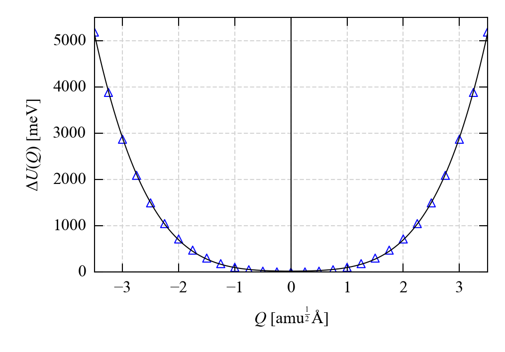

Example: SrO "ModeMap" Calculation
==================================

This example uses the [ModeMap tool](https://github.com/JMSkelton/ModeMap) to generate a potential-energy map along one of the &Gamma;-point optic modes of SrO.

A large range of the normal-mode coordinate <i>Q</i> is chosen in order to push the atoms into the anharmonic part of the potential, to obtain structural snapshots with high relative energies and large forces (gradients) and stresses (strain derivatives).

Setup
-----

We assume that users are familiar with ModeMap, and already have the scripts up and running according to the [code documentation](https://github.com/JMSkelton/ModeMap).
New ModeMap users are encouraged to first look at the examples included with it, as doing so will make some of the steps in this example easier to follow.

We will use the force constants obtained from the `IBRION 6` calculation in the SrO/`IBRION 6` [example](../Example_SrO-IBRION-6) as the required input to `Phonopy` via `ModeMap.py`.

Firstly, set up a &Gamma;-point finite-displacement calculation using the optimised SrO structure (`POSCAR.vasp` in this example):

`phonopy -d --dim="1 1 1" -c POSCAR.vasp`

Next, take the `vasprun.xml` file from the SrO finite-differences calculation and use `Phonopy` to generate a `FORCE_CONSTANTS` file:

`phonopy --fc vasprun.xml`

We can now use `ModeMap.py` to generate a sequence of structures displaced along one of the three &Gamma;-point optic modes:

`python ModeMap.py -c POSCAR.vasp --dim="1 1 1" --readfc --mode="0 0 0 6" --q_range="-5 5 0.25" --supercell="1 1 1"`

This generates a sequence of 41 displaced structures with normal-mode amplitudes ranging from <i>Q</i> = -5 amu<sup>1/2</sup> &#8491; to <i>Q</i> = 5 amu<sup>1/2</sup> &#8491;.
The displaced structures are stored in `ModeMap.tar.gz`, and information about the displacemed structures is written to `ModeMap.csv`.

Running the single-point calculations
-------------------------------------

The VASP `INCAR` and `KPOINTS` files used to perform the single-point calculations on the `MPOSCAR-*` files in `ModeMap.tar.gz` are provided in the [Single-Point-Calculations folder](./Single-Point-Calculations).
These should be paired with the `Sr_sv` (`PAW_PBE Sr_sv 07Sep2000`) and `O` (`PAW_PBE O 08Apr2002`) PAW pseudopotentials from the VASP database.

Running the calculation should produce a set of `OUTCAR` files similar to those in the `OUTCAR-Files.ref.tar.gz` archive.

Once the calculation is finished, extract the total energies, e.g. using the `ExtractTotalEnergies.py` script bundled with ModeMap, to generate an `ExtractTotalEnergies.csv` file.

Post-processing the output
--------------------------

First, run the ModeMap post-processing script to assign the total energies to normal-mode amplitudes and generate a `ModeMap_PostProcess.csv` file:

`python ModeMap_PostProcess.py`

The `ModeMap_Polyfit.py` script can then be used to inspect the potential-energy surface map along the mode:

`python ModeMap_PolyFit.py --degree=4 --plot_y="0 6000"`

This should generate a plot (`ModeMap_PolyFit.png`) similar to the following:



The potential-energy surface dominated by a quartic term at large displacements (try fitting with `--degree=2` to confirm that a quadratic term is insufficient).
The largest displacements (<i>Q</i> = &plusmn;5 amu<sup>1/2</sup> &#8491;) produce an increase of ~5.5 eV in the total energy, which should result in some large restoring forces on the atoms, and large stresses on the cell.

Preparing a GULP input file
---------------------------

The `OUTCARToGULP_ModeMap.py` script can be used to extract the structures, total energies, forces (gradients) and stress tensors (strain derivatives) from each `OUTCAR` file produced by the single-point calculations and to write them to a single GULP input file:

`python OUTCARToGULP_ModeMap.py OUTCAR-* -o "SrO-ModeMap.gulp" -n "q = (0, 0, 0), v = 6" --mode_map_csv="ModeMap_PostProcess.csv"`

This will produce an output file named `SrO-ModeMap.gulp` with a block of data for each of the displaced structures.

By providing an identifier (via the `-n` argument) and the path to the `ModeMap_PostProcess.csv` file generated in the previous step (`--mode_map_csv`), each data block is prefixed with a header that records what the structure corresponds to:

```
# Data for mode map q = (0, 0, 0), v = 6 w/ Q = -4.75 amu^1/2 A, dU(Q) = 4410 meV
# ===============================================================================
```

As in the SrO/`IBRION 6` [example](../Example_SrO-IBRION-6), `OUTCARToGULP_ModeMap.py` accepts a `--add_commands` flag, which can be used to add basic GULP commands to the output file:

`python OUTCARToGULP_ModeMap.py OUTCAR-* -o "SrO-ModeMap-Commands.gulp" -n "q = (0, 0, 0), v = 6" --mode_map_csv="ModeMap_PostProcess.csv" --add_commands`

The script also accepts the `--gradient_threshold` and `--stress_threshold` command-line arguments, which can be used to exclude structures with smaller gradients/stresses if desired:

`python OUTCARToGULP_ModeMap.py OUTCAR-* -o "SrO-ModeMap-Threshold.gulp" -n "q = (0, 0, 0), v = 6" --mode_map_csv="ModeMap_PostProcess.csv" --add_commands --gradient_threshold=1.0 --stress_threshold=1.0`

The output `SrO-ModeMap-Threshold.gulp` now contains data sets for a subset of 32 of the 41 structures, with the others replaced by comments indicating why they were omitted:

`# INFO: The gradient components and diagonal stress-tensor elements for "SrO (Input File 21 w/ Q = 0.00)" (OUTCAR-021) are below the set thresholds (gradients: 1.00e+00, stress: 1.00e+00) -> data set not output.`
