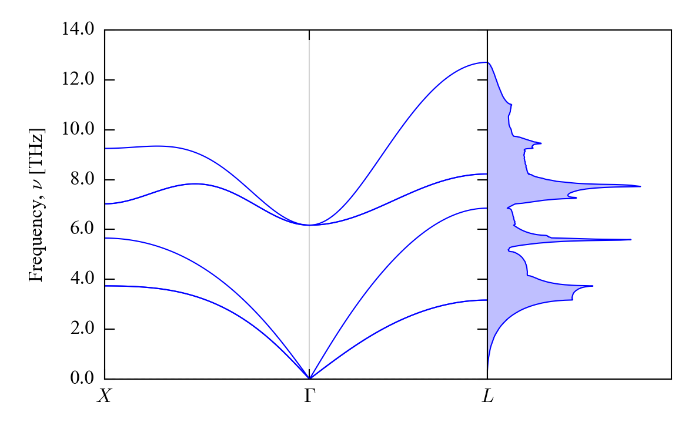
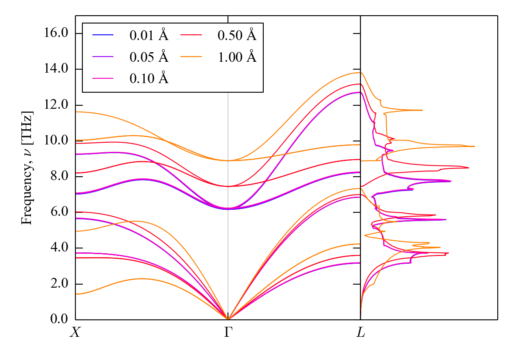

Example: SrO Phonopy Calculation
================================

In this example, we will perform a harmonic Phonopy calculation on SrO using a 2&times;2&times;2 supercell, with a set of successively larger finite-displacement steps, and use the `OUTCARToGULP_ModeMap.py` script to extract data from the `OUTCAR` files generated from the single-point force calculations.

Harmonic Phonopy Calculation
----------------------------

We assume users following this example have set up Phonopy and are familiar with the basics of using it.
If not, you are encouraged to first look through the documentation and examples on the [code website](https://atztogo.github.io/phonopy).

First, prepare a supercell finite-displacement calculation on the optimised SrO structure using Phonopy:

`phonopy -c POSCAR.vasp -d --dim="2 2 2"`

Perform single-point force calculations on the two displaced structures (`POSCAR-001`, `POSCAR-002`).
Example `INCAR` and `KPOINTS` files are provided, and should be paired with the `Sr_sv (PAW_PBE Sr_sv 07Sep2000)` and `O (PAW_PBE O 08Apr2002)` PAW pseudopotentials from the VASP database.
The output should be similar to the reference `OUTCAR` files in the [Step-0.01](./Step-0.01) directory.

Next, collect the forces from the `vasprun.xml` files and create a `FORCE_SETS` file:

`phonopy -f 001/vasprun.xml 002/vasprun.xml`

Finally, perform some post processing with Phonopy to check the phonon density of states (DoS)...:

`phonopy -c POSCAR.vasp -p -s Phonopy_PhononDoS.conf`

... and also the phonon dispersion:

`phonopy -c POSCAR.vasp -p -s Phonopy_PhononDispersion.conf`

The result should look similar to the following:



Different displacement steps
----------------------------

To obtain more data sets for fitting, we will prepare a set of Phonopy calculations with displacement steps from 0.01 &#8491; (the default) to 1 &#8491;.
The `Phonopy_Prepare.sh` script creates a subdirectory for each of a set of step sizes and calls Phonopy to prepare the displaced structures:

```bash
#!/bin/bash

for step in 0.01 0.05 0.10 0.50 1.00
do
    dir="Step-${step}"
    
    mkdir "${dir}"
    
    cd "${dir}"
    
    phonopy -d --dim="2 2 2" -c ../POSCAR.vasp --amplitude=${step}
    
    cd ..
done
```

After running, the script(s) will generate five directories named `Step-0.01`, `Step-0.05`, <i>etc</i>., each containing the basic setup for a harmonic Phonopy calculation.

We now need to run the five sets of single-point force calculations, which might be done with a suitably-modified version of the `Phonopy_Run.sh` script:

```bash
#!/bin/bash

for step in 0.01 0.05 0.10 0.50 1.00
do
    phonopyDir="Step-${step}"
    
    if [ -d "${phonopyDir}" ] ; then
        cd "${phonopyDir}"
        
        for poscarFile in `ls POSCAR-*`
        do
            runDir="${poscarFile/POSCAR-/}"
            
            if [ ! -d "${runDir}" ] ; then
                mkdir "${runDir}"
                
                cd "${runDir}"
                
                cp "../${poscarFile}" "POSCAR"
                
                for inputFile in "INCAR" "KPOINTS" "POTCAR"
                do
                    cp "../../${inputFile}" .
                done
                
                mpirun -np 16 vasp_std | tee "../${runDir}.out"
                
                cd ..
            fi
        done
        
        cd ..
    fi
done
```

Finally, for each displacement step, we need to collect the forces and perform the post processing as in the previous step (`Phonopy_PostProcess.sh`):

```bash
#!/bin/bash

for step in 0.01 0.05 0.10 0.50 1.00
do
    dir="Step-${step}"

    cd "${dir}"

    phonopy -f 001/vasprun.xml 002/vasprun.xml

    phonopy -c ../POSCAR.vasp --dim="2 2 2" --mesh="2 2 2" --gamma_center --fc_symmetry=1
    mv mesh.yaml mesh-2x2x2.yaml

    phonopy -c ../POSCAR.vasp -p -s ../Phonopy_PhononDoS.conf
    phonopy -c ../POSCAR.vasp -p -s ../Phonopy_PhononDispersion.conf

    cd ..
done
```

Comparing the DoS and dispersion curves calculated with the five different steps shows that whereas the smaller displacement steps produce similar results, the larger displacements lead to the atoms being pushed into the anharmonic part of the potential, which generally leads to higher frequencies:



This is also evident in comparing the phonon frequencies at the three symmetry-inequivalent phonon wavevectors (<b>q</b>-points) commensurate with the 2&times;2&times;2 supercell expansion (taken from the `mesh-2x2x2.yaml` files generated during the post processing):

| &nbsp;                     | 0.01 &#8491; | 0.05 &#8491; | 0.10 &#8491; | 0.50 &#8491; | 1.00 &#8491; |
| -------------------------- | ------------ | ------------ | ------------ | ------------ | ------------ |
| &Gamma;<sub>&nu;=4-6</sub> |        6.172 |        6.187 |        6.236 |        7.456 |        8.895 |
| *X*<sub>&nu;=1,2</sub>     |        3.735 |        3.734 |        3.731 |        3.463 |        1.432 |
| *X*<sub>&nu;=3</sub>       |        5.653 |        5.660 |        5.682 |        6.028 |        4.950 |
| *X*<sub>&nu;=4,5</sub>     |        7.027 |        7.039 |        7.080 |        8.206 |       10.033 |
| *X*<sub>&nu;=6</sub>       |        9.249 |        9.254 |        9.269 |        9.861 |       11.622 |
| *L*<sub>&nu;=1,2</sub>     |        3.166 |        3.171 |        3.187 |        3.599 |        4.236 |
| *L*<sub>&nu;=3</sub>       |        6.852 |        6.854 |        6.859 |        7.000 |        7.338 |
| *L*<sub>&nu;=4,5</sub>     |        8.223 |        8.231 |        8.258 |        8.958 |        9.782 |
| *L*<sub>&nu;=6</sub>       |       12.702 |       12.707 |       12.723 |       13.176 |       13.814 |

In most cases, the larger displacement steps yield larger phonon frequencies, although the *X*-point acoustic modes (*X*<sub>&nu;=1,2</sub> and *X*<sub>&nu;=3</sub>) appear to be interesting exceptions, as can also be seen in the dispersion curves.

Preparing GULP input files
--------------------------

We can use `OUTCARToGULP_ModeMap.py` to extract the total energies, gradients and strain derivatives from the pairs of `OUTCAR` files generated during each of the Phonopy calculations (`Phonopy_OutputGULP.sh`):

```bash
#!/bin/bash

for step in 0.01 0.05 0.10 0.50 1.00
do
    dir="Step-${step}"

    cd "${dir}"

    python OUTCARToGULP_ModeMap.py */OUTCAR -o "Step-${step}.gulp" -n "Phonopy (${step} A)" --add_commands

    cd ..
done
```

We use the `-n` command-line argument to have the displacement step added to the header comments above the data blocks, and we also set the `--add_arguments` flag to have some useful GULP commands included in the output files.

Finally, we might want to join the GULP input generated from each of the five Phonopy calculations into a single file, which can be done using the second half of `Phonopy_OutputGULP.sh`:

```bash
head -n 3 Step-0.01/Step-0.01.gulp > Phonopy.gulp

for step in 0.01 0.05 0.10 0.50 1.00
do
    tail -n +4 Step-${step}/Step-${step}.gulp | tail -r  | tail -n +4 | tail -r >> Phonopy.gulp

    # The version of `head` macOS 10.12.3 doesn't accept negative -n arguments; on Unix machines using versions that do, the following works and avoids the two calls to `tail -r`.
    # tail -n +4 Step-${step}/Step-${step}.gulp | head -n -3 >> Phonopy.gulp
done

tail -n 3 Step-0.01/Step-0.01.gulp >> Phonopy.gulp
```
